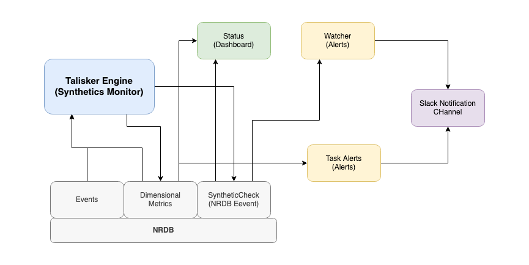

# Talisker - NRDB NRQL Alerting Engine
The Talisker engine allows you to alert on NRQL queries longer than the 2 hour streaming alerts limit. The engine runs within the New Relic Synthetic Monitor container and can be confifured with a simple JSON configuration.

At its simplest you can simply add the script to your synthetic monitor, but this project includes a full terraform module that builds not only the monitor but a dashboard and default alerts too. You might not want all of that cruft, simply remove what you dont need.


## Stand alone mode
For stand alone simply copy the content of (base_script.js)[./modules/Talisker/src/base_script.js] into a New Relic API monitor. Un comment the top block and set the values as required. Details on task settings can be found below.

Set the monitor name and ID as approriate for the monitor you have set the script up in. You could use any ID and name you like too.

You will need to specify two API keys, one a user key api and one ingest insert key. These are to query and inject the data respectively. We recommend that you store these in the secure credential store.


## Terraform application mode
This project includes a terraform module that makes it easy to setup both the script and also some monitoring of the script. It creates a dashboard, the secure credentials, some alerts (one for the engine, one for all the tasks) and as an example a slack notification channel.


To use the terraform version you need to supply the various API keys and data. Copy the `[runtf.sh.sample](runtf.sh.sample)` to `run.tf` and add the values as follows:

- **terraformNRAccountId**: The account ID that the monitor should reside.
- **terraformAPIKey**: A user API key that has rights to create dashboards, alerts, etc resources. (NRAK-...)
- **userAPIKey**: Another user API key that has query rights (NRAK-...)
- **insertAPIKey**: An ingest insert key (NRII-...)
- **slackChannelURL**: A slack webhook url

In the main.tf setup the tasks as described below.

## Task configuration
In stand alone mode you configure tasks through the TASKS json object. For terraform you configure the tasks in the main.tf. The terraform version allows you to specify alert criteria for the data too but for the stand alone mode you'll need to setup your own alerts.

Each task you can specify:

- **id**: A unique id for this task in this task list
- **name**: A more friendly readable name for the task
- **accountId**: The account ID to run the query against
- **query**: The NRQL to run. Its best to name your return value using the `as` operator. e.g. `FROM Public_APICall select count(*) as value since 1 day ago compare with 1 week ago`. Note that `compare with` queries are automaticlly recognised and the percentage change is returned.
- **selector**: The name of the field contianing the data. e.g. 'value'. This supports dot notation, e.g to reference the value of `..percentile(duration,95) as value...` you would set the selector to  `value.95`
- **chaining**: one of:
  - `NONE`: Just return the value from query
  - `DIFF`: Return the difference from the value from this query to the previous task
  - `PERC_DIFF`: Return the difference from the value from this query to the previous task as a percentage
- **fillNullValue**: The value to use for null results, usually zero.
- **invertResult**: Should the result be inverted? true|false (Alerts can only be set on positive values so this allows you to invert the result and alert upon it.)

Additionally these settings should be set in terraform to control the alert conditions: (each task becomes a single condition in an single alert policy)

- **alert_operator**
- **alert_critical_threshold**
- **alert_warning_threshold**
- **alert_threshold_occurrences**
- **enabled**: true|false - if false then condition is created but not enabled

Consult the [New Relic Terraform provider documentation](https://registry.terraform.io/providers/newrelic/newrelic/latest/docs/resources/nrql_alert_condition) for a guide on the values for these fields.

Example JSON config:

```javascript
const TASKS = [{
    "id":"example",
    "name":"Example",
    "accountId":"123456",
    "selector":"value",
    "chaining":"NONE",
    "fillNullValue": 0,
    "invertResult": false,
    "query":"FROM Public_APICall select uniqueCount(api) as value since 1 day ago"
}]
```

## Metrics created by Talisker
The script will process each task in the TASKS array and drop a metric into New Relic via the metrics API. Each metric has the form:

- **taslisker.value** - the value thats returned by your query
- **talisker.id** - the id of the task
- **talisker.name** - the name of the task
- **talisker.monitorName** - the name of the monitor (as set by you)
- **talisker.monitorId** - the ID of the monitor (as set by you)

You could for example target the output of a task with the following NRQL: 
`from Metric select latest(talisker.value) where talisker.monitorId='your-monitor-id' and talisker.id='your-task-id`

